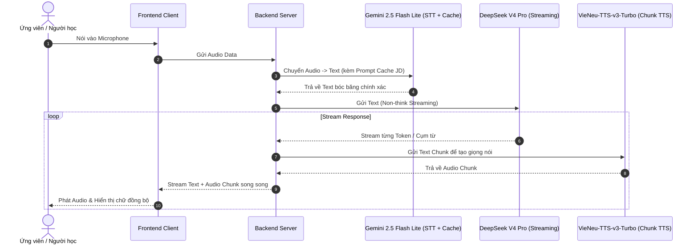

# Kiến Trúc Hệ Thống & Tài Liệu Vận Hành AI Voice Assistant

Tài liệu này mô tả chi tiết cách thức hoạt động, ứng dụng thực tiễn, tính năng cốt lõi, vai trò của từng file mã nguồn và kiến trúc luồng dữ liệu thời gian thực (**Real-time Ping-Pong Flow**) của hệ thống Voice AI thông minh dành cho Mock Interview và Luyện tập kiến thức.

---

## 1. Tổng Quan & Tầm Nhìn Dự Án (Overview & Vision)

Hệ thống được thiết kế với mục tiêu mang lại **trải nghiệm giao tiếp giọng nói liền mạch, độ trễ gần như bằng 0 (Near-Zero Latency)**, mô phỏng hoàn hảo một cuộc hội thoại/phỏng vấn giữa người và người trong đời thực.

### Ứng Dụng Thực Tiễn:
1. **Mô Phỏng Phỏng Vấn Doanh Nghiệp (Mock Interview Platform)**: Hỗ trợ ứng viên luyện tập phỏng vấn sát với thực tế tuyển dụng, đồng thời giúp doanh nghiệp tự động hóa quá trình sơ loại và đánh giá ứng viên.
2. **Gia Sư & Luyện Tập Cá Nhân Hóa (AI 1-on-1 Knowledge Tutor)**: Xây dựng lộ trình học tập, củng cố kiến thức theo từng vị trí công việc, kiểm tra và phản hồi trực tiếp bằng giọng nói.

---

## 2. Cấu Trúc Dự Án & Tác Dụng Của Từng File (Project File Breakdown)

```
d:\Android-APP\test_ai\
├── main.py              # File chạy chính (Main entry point) điều phối toàn bộ pipeline CLI
├── audio_recorder.py    # Module xử lý thu âm từ Microphone thời gian thực
├── stt_engine.py        # Module nhận diện giọng nói tiếng Việt (Speech-to-Text)
├── gemini_agent.py      # Module xử lý hội thoại LLM và sinh thẻ cảm xúc (Emotional Cues)
├── tts_engine.py        # Module tổng hợp giọng nói tiếng Việt có cảm xúc (Text-to-Speech)
├── test.py              # Script kiểm thử độc lập từng thành phần (Mic/Loa, STT, LLM, TTS)
├── .env                 # File cấu hình biến môi trường và API Keys
├── pyproject.toml       # Quản lý metadata và dependencies của dự án (chuẩn PEP 621 / uv)
├── uv.lock              # Lockfile khóa phiên bản dependencies để đảm bảo môi trường đồng nhất
└── AGENTS.md            # Tài liệu kiến trúc hệ thống và hướng dẫn vận hành kỹ thuật
```

### Chi Tiết Chức Năng Từng File:

| File | Tác dụng & Trách nhiệm chính |
| :--- | :--- |
| **`main.py`** | Điểm khởi chạy ứng dụng Voice Assistant trên dòng lệnh (CLI). Đóng vai trò nhạc trưởng kết nối tuần tự luồng: Thu âm $\rightarrow$ STT $\rightarrow$ LLM $\rightarrow$ TTS $\rightarrow$ Phát loa. Quản lý vòng lặp đàm thoại đa lượt và lệnh thoát. |
| **`audio_recorder.py`** | Quản lý thiết bị Microphone thông qua `sounddevice` và `numpy`. Hỗ trợ chế độ thu âm tương tác (bấm Enter để nói, Enter để gửi) chuẩn hóa tần số 16kHz Mono phù hợp với các mô hình STT. |
| **`stt_engine.py`** | Bọc lớp xử lý nhận dạng giọng nói (STT). Hiện tại tích hợp mô hình **`vinai/PhoWhisper-small`** (hoặc tiny/base) chạy cục bộ qua Hugging Face Transformers. |
| **`gemini_agent.py`** | Bọc lớp kết nối với **Google Gemini API** (mặc định `gemini-2.5-flash`). Thiết lập System Prompt chuyên biệt để tự động chèn các thẻ ngữ điệu cảm xúc tự nhiên (`[cười]`, `[thở dài]`, `[hắng giọng]`) vào văn bản phản hồi. |
| **`tts_engine.py`** | Bọc lớp tổng hợp giọng nói (TTS) sử dụng thư viện **`VieNeu-TTS-v3-Turbo`**. Đọc hiểu các thẻ cảm xúc trong câu trả lời từ LLM và phát ra loa bằng `sounddevice`. |
| **`test.py`** | Công cụ kiểm tra độc lập (Diagnostic tool). Cho phép chạy test riêng lẻ từng module: kiểm tra thiết bị âm thanh, test kết nối Gemini API, test đọc giọng VieNeu-TTS, test nạp model PhoWhisper STT. |
| **`.env`** | Lưu trữ các biến môi trường nhạy cảm như `GEMINI_API_KEY`, `HF_TOKEN`, cấu hình tên model (`GEMINI_MODEL`, `STT_MODEL`), giúp tách biệt mã nguồn và cấu hình. |

---

## 3. Khả Năng Thay Thế & Hoán Đổi Mô Hình AI (Model-Agnostic Architecture)

> [!NOTE]
> **Kiến trúc cắm-rút linh hoạt (Plug-and-Play / Adapter Pattern):**
> Tất cả các module AI trong dự án đều được thiết kế dưới dạng Interface độc lập. Bạn hoàn toàn có thể thay thế bất kỳ mô hình AI nào (STT, LLM, TTS) bằng các giải pháp hoặc nhà cung cấp khác chỉ bằng cách thay đổi cấu hình `.env` hoặc bọc thêm class Adapter tương ứng:

```
                  ┌──────────────────────────────────────────────┐
                  │          Plug-and-Play Architecture          │
                  └──────────────────────────────────────────────┘
                       │                     │                │
            ┌──────────▼──────────┐ ┌────────▼────────┐ ┌─────▼───────────┐
            │     STT Layer       │ │    LLM Layer    │ │   TTS Layer     │
            ├─────────────────────┤ ├─────────────────┤ ├─────────────────┤
Current:    │ PhoWhisper (Local)  │ │ Gemini 2.5 Flash│ │ VieNeu-TTS-v3   │
Alternative:│ Gemini 2.5 STT      │ │ DeepSeek V4 Pro │ │ MeloTTS / Kokoro│
            │ Whisper.cpp / Cloud │ │ GPT-4o / Claude │ │ Zalo / ElevenLab│
            └─────────────────────┘ └─────────────────┘ └─────────────────┘
```

1. **Thay thế STT (Speech-to-Text)**:
   - **Hiện tại**: `PhoWhisper-small` (chạy trên máy cá nhân qua CPU/GPU).
   - **Lựa chọn thay thế**: `Gemini 2.5 Flash Lite` (Audio STT với Prompt Caching JD), `OpenAI Whisper API`, `Faster-Whisper`, hoặc `Whisper.cpp` để tăng tốc độ bóc băng.
2. **Thay thế LLM (Large Language Model)**:
   - **Hiện tại**: `Gemini 2.5 Flash` (qua Google GenAI SDK).
   - **Lựa chọn thay thế**: `DeepSeek V4 Pro / DeepSeek V3` (qua OpenAI-compatible endpoint / vLLM để streaming siêu tốc), `GPT-4o-mini`, `Claude 3.5 Haiku`, hoặc mô hình Open-Source nội bộ (Llama 3, Qwen 2.5).
3. **Thay thế TTS (Text-to-Speech)**:
   - **Hiện tại**: `VieNeu-TTS-v3-Turbo` (giọng Việt tự nhiên có cảm xúc).
   - **Lựa chọn thay thế**: `Kokoro-TTS`, `MeloTTS`, `Zalo AI Voice API`, `FPT.AI Voice`, `ElevenLabs Multilingual v2`.

---

## 4. Các Tính Năng Cốt Lõi (Core Features)

Hệ thống được chia thành **2 luồng nghiệp vụ chính**:

### 🎯 Luồng 1: Mock Interview (Mô phỏng phỏng vấn chuyên nghiệp)
- **Mục tiêu**: Đánh giá toàn diện 2 khía cạnh của ứng viên:
  - **Năng lực chuyên môn (Hard Skills)**: Kiến thức kỹ thuật, tư duy giải quyết vấn đề, độ sâu hiểu biết theo từng chuyên ngành.
  - **Kỹ năng mềm & Phong thái (Soft Skills)**: Tốc độ nói, khả năng ngắt câu, mức độ tạp âm môi trường, độ tự tin, sự bình tĩnh và khả năng kiểm soát cảm xúc khi trả lời câu hỏi hóc búa.
- **Cơ chế sinh câu hỏi động (Dynamic Question Generation)**:
  - Dựa trên **Job Description (JD)** do người dùng lựa chọn hoặc tải lên.
  - Tự động kết hợp hài hòa giữa câu hỏi kiến thức nền tảng (Foundation) và các câu hỏi tình huống thực tế/chuyên sâu (Scenario-based & System Design).

---

### 📚 Luồng 2: Luyện Tập Kiến Thức (AI Knowledge Tutor)
- **Bước 1: Chọn mục tiêu học tập**: Người dùng chủ động lựa chọn vị trí công việc (ví dụ: Frontend Developer, Backend Golang, Data Engineer, AI Product Manager...) hoặc mảng kiến thức cụ thể cần bồi dưỡng.
- **Bước 2: Phân loại & Ưu tiên lộ trình**: Hệ thống tự động phân tích lỗ hổng kiến thức, lập và lưu trữ thứ tự ưu tiên (học gì trước, thực hành gì sau) trực tiếp vào hồ sơ người dùng.
- **Bước 3: AI Gia sư đồng hành**: AI đóng vai trò như một mentor 1-on-1, tiến hành hỏi đáp, giải thích cặn kẽ các khái niệm khó, và kiểm tra đánh giá liên tục theo đúng tiến độ lộ trình cá nhân hóa.

---

## 5. Kiến Trúc Luồng Xử Lý Real-time (Ping-Pong Flow)

Để đạt được độ trễ tối thiểu (sub-second response), hệ thống áp dụng cơ chế **Ping-Pong Streaming Pipeline** xuyên suốt 4 giai đoạn:

```
[ Frontend: Mic Capture ]
          │ (Audio Stream / Chunk)
          ▼
[ 1. Lắng nghe thông minh: Gemini 2.5 Flash Lite + Prompt Caching (JD) ]
          │ (Transcribed Text)
          ▼
[ 2. Suy luận phản hồi: DeepSeek V4 Pro (Non-think Streaming) ]
          │ (Stream Token / Text Sentence Chunks)
          ▼
[ 3. Tổng hợp giọng nói: VieNeu-TTS-v3-Turbo (Parallel Chunk TTS) ]
          │ (Audio Chunks Stream)
          ▼
[ 4. Trải nghiệm người dùng: Stream Text + Audio song song về UI ]
```

### Chi Tiết Từng Bước Xử Lý:

1. **Lắng nghe thông minh (Smart STT with Context & Prompt Caching)**:
   - **Input**: Âm thanh giọng nói của ứng viên từ Frontend được ghi nhận và gửi lên Server.
   - **Xử lý**: Backend gọi API **Gemini 2.5 Flash Lite** để chuyển đổi Audio sang Text.
   - **Tối ưu hóa**: Áp dụng **Prompt Caching** kết hợp thông tin Job Description (JD) và bối cảnh phỏng vấn, giúp hệ thống nhận diện chính xác 100% các thuật ngữ kỹ thuật chuyên ngành (ví dụ: Kubernetes, CI/CD, Multithreading, Deadlock...), giảm chi phí và giảm triệt để độ trễ.

2. **Suy luận phản hồi siêu tốc (Streaming LLM Reasoning)**:
   - **Input**: Văn bản vừa bóc băng từ STT.
   - **Xử lý**: Backend chuyển tiếp ngay cho **DeepSeek V4 Pro** (chạy ở chế độ **Non-think** để tối ưu tốc độ sinh từ đầu tiên - TTFT).
   - **Cơ chế**: Mở kết nối **Streaming Text (SSE/WebSocket)** để nhận từng token trả về ngay lập tức mà không cần đợi hoàn tất cả câu trả lời.

3. **Tổng hợp giọng nói thần tốc (Chunked Parallel TTS)**:
   - **Xử lý**: Ngay khi nhận được từng đoạn chữ ngắn (sentence chunk / vế câu hoàn chỉnh) từ DeepSeek, Backend đẩy ngay lập tức vào API **VieNeu-TTS-v3-Turbo**.
   - **Tối ưu hóa**: Xử lý sinh âm thanh dạng song song theo từng đoạn nhỏ (Parallel Audio Chunks) kèm các nhãn cảm xúc tự nhiên của Tiếng Việt.

4. **Trải nghiệm người dùng liền mạch (Full-Duplex Stream & Audio-Text Sync)**:
   - Stream liên tục đồng thời **Text** và **Audio Chunks** về Frontend.
   - Giao diện người dùng render chữ chạy đồng bộ với âm thanh phát ra từ loa, loại bỏ hoàn toàn khoảng lặng chờ đợi, mang lại cảm giác đối thoại thời gian thực tự nhiên như người thật.

---

## 6. Sơ Đồ Tuần Tự (Sequence Diagram)



---

## 7. Tech Stack & Thành Phần Kỹ Thuật

| Thành phần | Công nghệ / Model | Vai trò & Điểm nổi bật |
| :--- | :--- | :--- |
| **STT (Speech-to-Text)** | **Gemini 2.5 Flash Lite** *(hoặc PhoWhisper Local)* | Bóc băng giọng nói Tiếng Việt, hỗ trợ Prompt Caching nhận diện thuật ngữ JD chính xác cao. |
| **LLM Engine** | **DeepSeek V4 Pro** *(Non-think Mode)* | Phân tích câu trả lời, đánh giá năng lực, phản hồi streaming cực nhanh. |
| **TTS (Text-to-Speech)** | **VieNeu-TTS-v3-Turbo** | Tổng hợp giọng nói Tiếng Việt tự nhiên, hỗ trợ emotion cues (`[cười]`, `[thở dài]`, ...), xử lý chunk siêu tốc. |
| **Giao thức truyền dẫn** | **WebSocket / SSE** | Đảm bảo luồng dữ liệu hai chiều âm thanh và văn bản đạt độ trễ sub-second. |
| **Quản lý lộ trình** | **User Profile & Knowledge Graph** | Lưu vết lịch sử phỏng vấn, điểm mạnh/yếu, sắp xếp ưu tiên lộ trình bồi dưỡng kiến thức. |

---

## 8. Định Hướng Phát Triển (Next Milestones)

- [x] Thử nghiệm thành công pipeline STT (PhoWhisper) + Gemini LLM + VieNeu-TTS Engine trên Local CLI.
- [ ] Tích hợp API Gemini 2.5 Flash Lite Audio STT với Prompt Caching context theo từng JD.
- [ ] Thiết lập kết nối Streaming Text với DeepSeek V4 Pro (Non-think mode).
- [ ] Xây dựng bộ đệm phân tách câu (Sentence Chunking Buffer) để gọi VieNeu-TTS song song.
- [ ] Phát triển giao diện Web/Mobile hỗ trợ Audio Streaming và hiển thị tiến trình đồng bộ thời gian thực.
